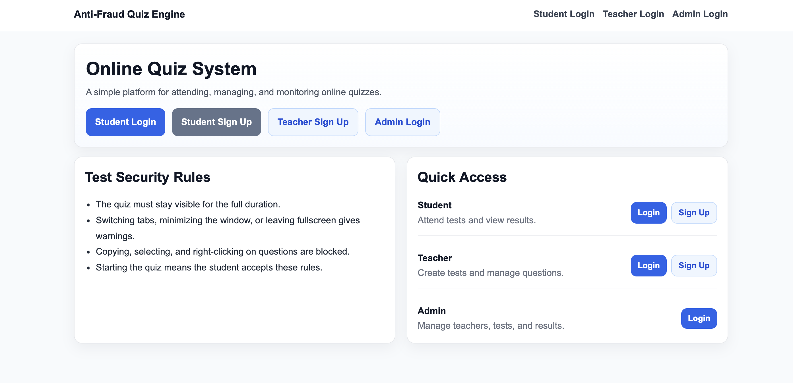
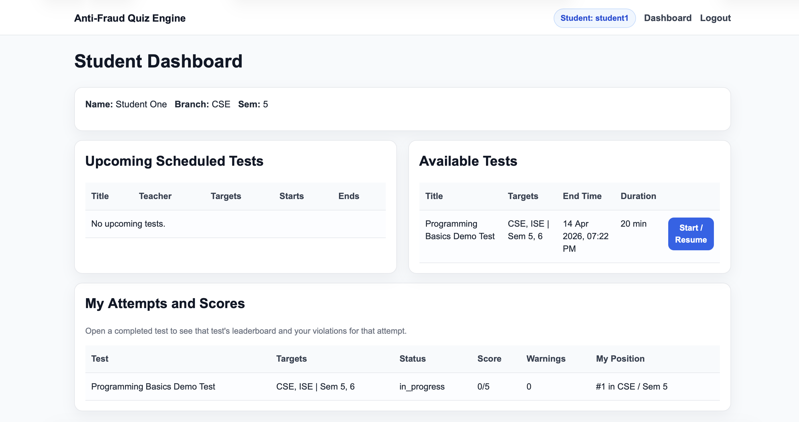
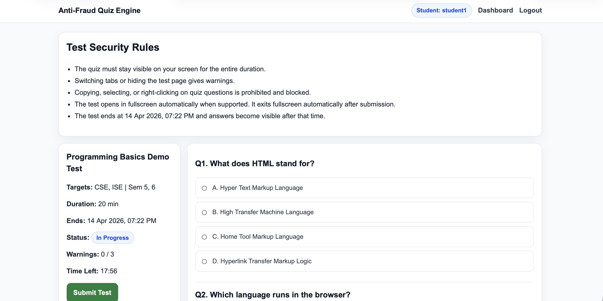
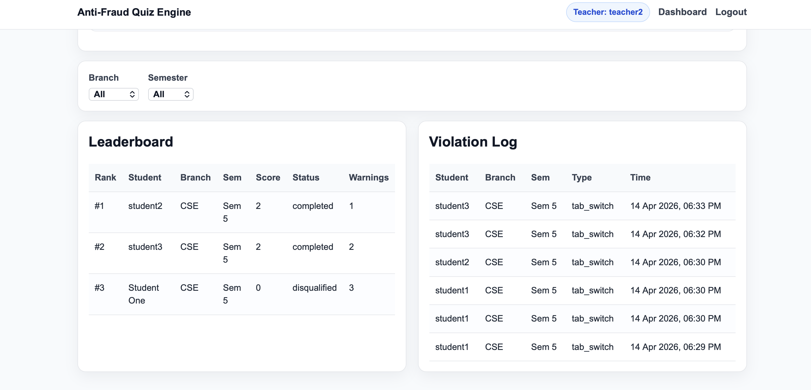

# Anti-Fraud Quiz Engine

A complete Flask project using **HTML templates, CSS, JavaScript, and SQL** for a secure MCQ exam platform.

## Features

- Student, Teacher, and Admin roles
- Teacher approval workflow by admin
- MCQ test creation and scheduling
- Question management per test
- Automatic scoring
- Upcoming tests for students
- Leaderboard and violation logs for teachers
- Forgot password demo flow
- Anti-fraud browser protections:
  - block right-click
  - block copy/cut/paste inside quiz area
  - visibility change warning
  - blur warning
  - fullscreen exit warning
  - auto-disqualify after repeated violations
  - auto-save selected answers

## Important Realism Note

This project can **detect and log many browser-level cheating signals**, but a normal web browser **cannot fully block screenshots or all OS/app switching** in a guaranteed way. For true lockdown behavior, a native app or dedicated secure exam browser is needed.

## Tech Stack

- Python + Flask
- SQLite (SQL database, zero setup)
- HTML templates
- CSS
- Vanilla JavaScript

## Screenshots

### Login Page


### Student Dashboard


### Quiz Page


### Leaderboard



## Project Structure

```text
anti_fraud_quiz_engine/
├── app.py
├── database.sql
├── requirements.txt
├── .env.example
├── README.md
├── PROJECT_PROMPT.md
├── instance/
├── static/
│   ├── css/style.css
│   └── js/quiz_security.js
└── templates/
    ├── base.html
    ├── index.html
    ├── login.html
    ├── signup.html
    ├── forgot_password.html
    ├── reset_password.html
    ├── admin_dashboard.html
    ├── teacher_dashboard.html
    ├── create_test.html
    ├── manage_test.html
    ├── student_dashboard.html
    ├── take_test.html
    ├── result.html
    └── error.html
```

## Quick Start

### 1. Open terminal in the project folder

### 2. Create virtual environment

**Windows**
```bash
python -m venv venv
venv\Scripts\activate
```

**macOS / Linux**
```bash
python3 -m venv venv
source venv/bin/activate
```

### 3. Install dependencies

```bash
pip install -r requirements.txt
```

### 4. Run the app

```bash
python app.py
```

### 5. Open in browser

```text
http://127.0.0.1:5000
```

## Default Demo Accounts

- Admin: `admin` / `Admin@123`
- Teacher: `teacher1` / `Teacher@123`
- Student: `student1` / `Student@123`

## Main Flows

### Student

- sign up
- login
- forgot password
- see upcoming tests
- start or resume available tests
- take test with anti-fraud monitoring
- view results

### Teacher

- sign up with credentials
- wait for admin approval
- login after approval
- create tests
- add and delete MCQ questions
- view leaderboard and violation logs

### Admin

- login
- approve or decline teacher applications
- manage all teachers, students, and tests

## Notes For Improvement

You can extend this by adding:

- email sending for reset links
- CSV export of leaderboards
- pagination
- JWT/API mode
- webcam / face monitoring integration
- PostgreSQL or MySQL instead of SQLite
- secure browser / desktop wrapper for stronger anti-cheat enforcement
# anti-fraud-quiz-platform
